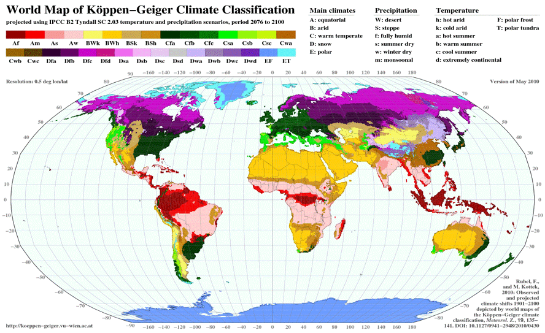

#OCA

<!--   <a href="https://franfurey.github.io/aquaViva/" target="_blank"> -->
    
  </a>

# Open-Climate-Analysis
# About
This is a repository gathering a bunch of climate-related data handling/retrieving sollutions. To help professional from diverse field to easily get access to climate data and ready analysis classification using koppen algorithm without having that much trouble. The main language used is Python through jupyter notebook. The goal is to make an interactive web map that would allow visualize open source climate data through their respective API's
### What this notebook does ?
1. Retrieve Data from Nasa Power Data or Era5 (Soon)
2. Make a climate type classification following Köppen's Classification
3. Provide diagrams highlighting temperature and precipitation anomalies/tendencies.
4. Make predictions for both parameters.

To this date (24/02/2025), this notebook is not yet exhaustive and is going to be improved gradually. Please feel free to contribute.
For any questions/collaborations,feel free to reach me on [LinkedIn](https://www.linkedin.com/in/el-hadji-malick-dieye-geomaticien/)

**Created by El Hadji Malick DIEYE | Earth Observation Specialist**

